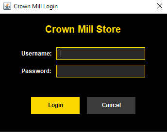
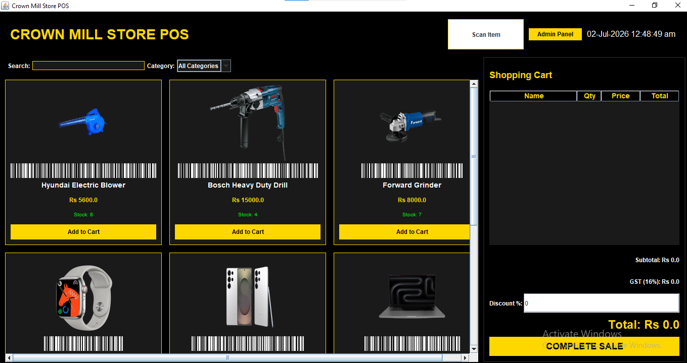
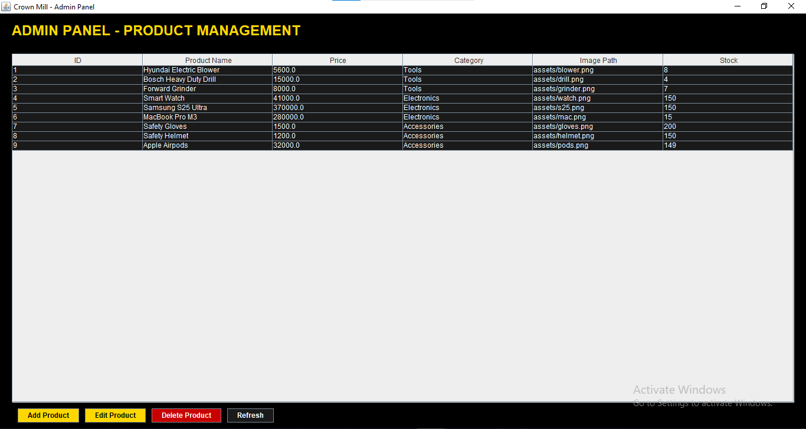
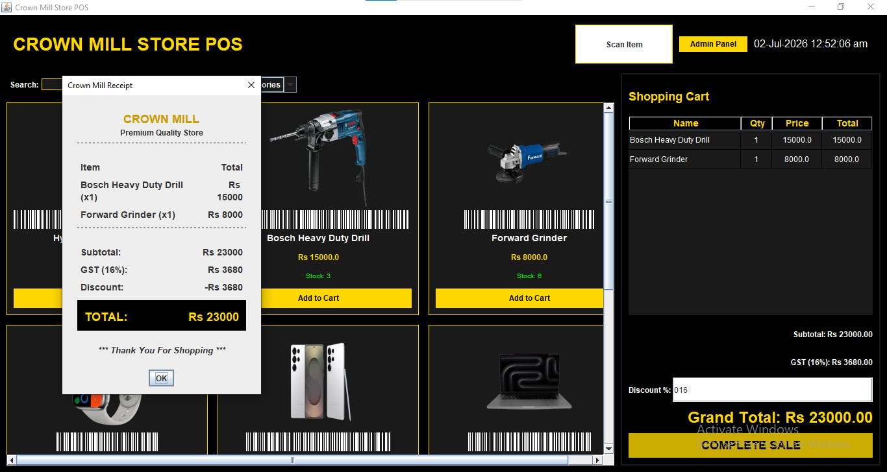

# 🏬 CrownMill POS (Point of Sale)

<div align="center">
  
  
  
</div>

<br />

**CrownMill POS** is a fully-featured, desktop-based Point of Sale application built with Java and SQLite. It is designed to streamline retail store operations, offering an intuitive UI with a sleek dark theme (Black & Gold). 

---

## ✨ Features

- **🔒 Secure Login System**: Access-controlled environment to protect sensitive store data.
- **🛒 Smart Cart Management**: Easily add products to the cart, calculate totals, sub-totals, and taxes in real-time.
- **🧾 Receipt Generation & Printing**: Automatically generate and print elegant customer receipts upon checkout completion.
- **🔐 Admin Panel**: Secure backend interface to manage inventory, update stocks, and oversee sales records.
- **📊 SQLite Database Integration**: Reliable and fast local storage for products, transactions, and inventory.
- **🏷️ Barcode Generator**: Built-in functionality to generate and read product barcodes for faster checkout.
- **💾 Automatic Database Backups**: Securely back up your database to prevent data loss.
- **🎨 Modern UI**: Clean, responsive, and visually appealing dark mode UI built with Java Swing.

---

## 🛠️ Tech Stack

- **Language:** Java (JDK 8+)
- **GUI Framework:** Java Swing
- **Database:** SQLite (JDBC)
- **Packaging:** Launch4j (for `.exe` generation)

---

## 🚀 Getting Started

### Prerequisites
- [Java Development Kit (JDK)](https://www.oracle.com/java/technologies/downloads/) (version 8 or higher)
- [Git](https://git-scm.com/)

### Installation & Setup

1. **Clone the repository:**
   ```bash
   git clone https://github.com/asharijaz328-cmd/crownmill-pos.git
   cd crownmill-pos
   ```

2. **Compile and Run:**
   - If using an IDE (like IntelliJ IDEA, Eclipse, or VS Code), import the project and run `POSUI.java`.
   - Ensure that the SQLite JDBC driver (`Lib/sqlite-jdbc-3.41.2.1.jar`) is added to your project's build path/classpath.

3. **Running via Batch Script (Windows):**
   Simply double-click the `Run_Project.bat` or `Start_CrownMill_POS.bat` file included in the root directory.

---

## 📸 Screenshots

| Login System | POS Dashboard |
| :---: | :---: |
|  |  |

| Admin Panel | Receipt & Checkout |
| :---: | :---: |
|  |  |

---

## 🤝 Contributing

Contributions, issues, and feature requests are welcome! Feel free to check the [issues page](https://github.com/asharijaz328-cmd/crownmill-pos/issues).

## 📝 License

This project is open-source and available under the [MIT License](LICENSE).
---
<p align="center"> Made with ❤️ by Ashar Ijaz</p>


